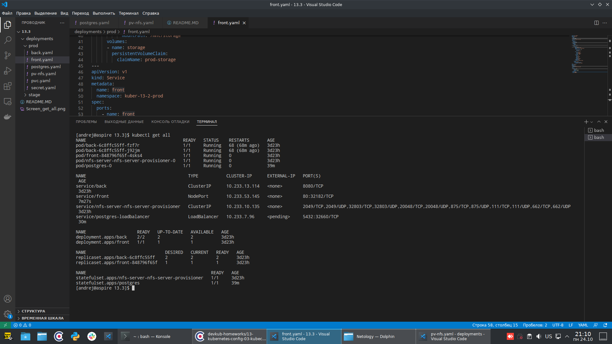
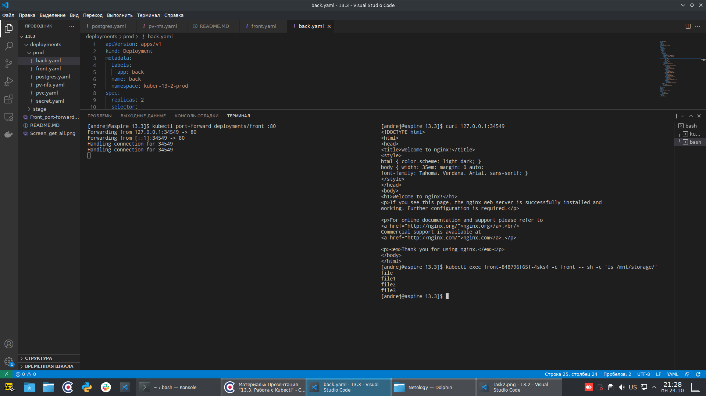
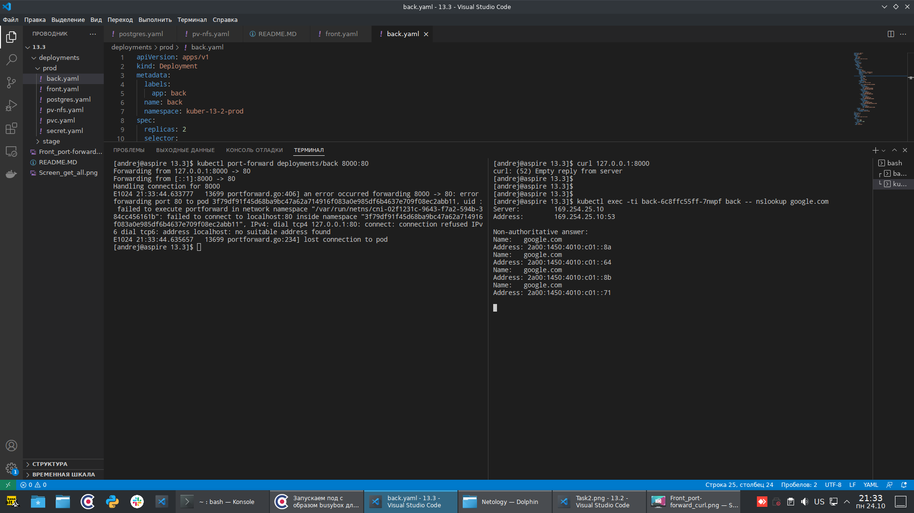
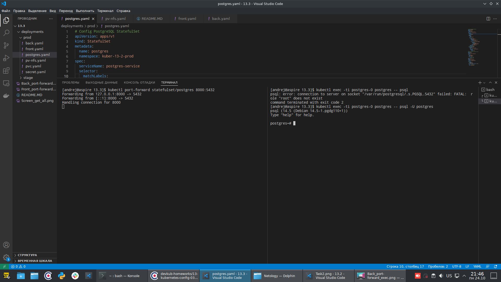
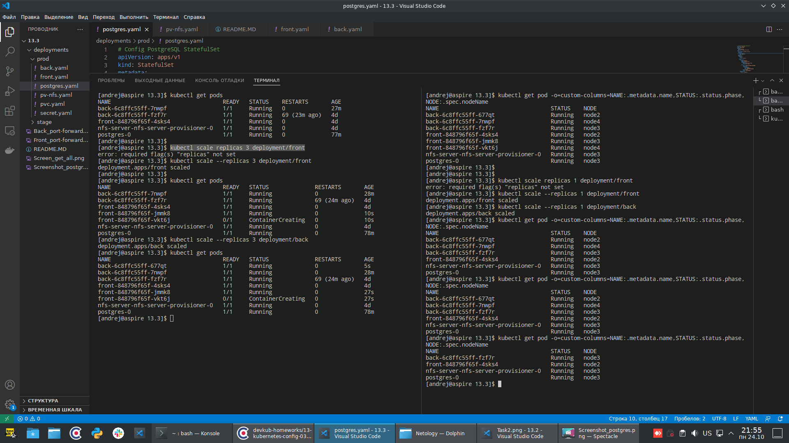
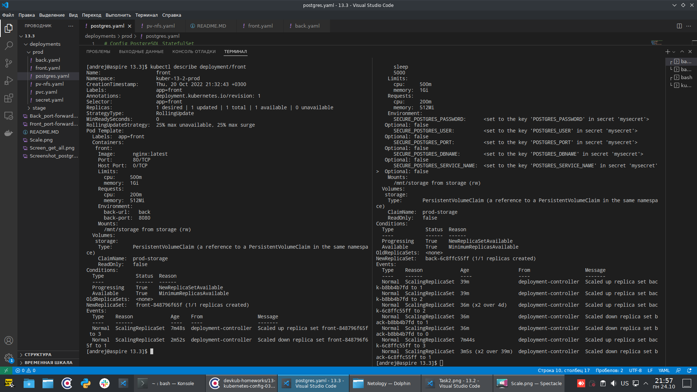

# Домашнее задание к занятию "13.3 работа с kubectl"
## Задание 1: проверить работоспособность каждого компонента
Для проверки работы можно использовать 2 способа: port-forward и exec. Используя оба способа, проверьте каждый компонент:
* сделайте запросы к бекенду;
* сделайте запросы к фронту;
* подключитесь к базе данных.

## Ответ:
Использовал тот же кластер и тот же `namespace`, что и в предыдущей работе. Только добавил туда `postgres`.

Вот так выглядит `kubectl get all`:

После чего сделал сделал проброс порта и запросы к `front`:

После чего сделал то же самое с `back`:

Здесь `curl` дал `Empty reply from server`, потому что там не nginx, а busybox. Через `exec` команды в контейнере выполняются.

Далее подключился к базе данных:

---

## Задание 2: ручное масштабирование

При работе с приложением иногда может потребоваться вручную добавить пару копий. Используя команду kubectl scale, попробуйте увеличить количество бекенда и фронта до 3. Проверьте, на каких нодах оказались копии после каждого действия (kubectl describe, kubectl get pods -o wide). После уменьшите количество копий до 1.

## Ответ:

Сначала увеличил число `front` и `back` до 3, посмотрел, потом уменьшил до 1:

Только сморел не толкьо с помощью `kubectl get pods -o wide`, но и командой `kubectl get pod -o=custom-columns=NAME:.metadata.name,STATUS:.status.phase,NODE:.spec.nodeName`

Лаконичный вывод получается. Распределение по нодам почти равномерное. Исключение - `postgres`, потому что он `StatefulSet`.
Вот такой получился `describe` по деплойментам:

